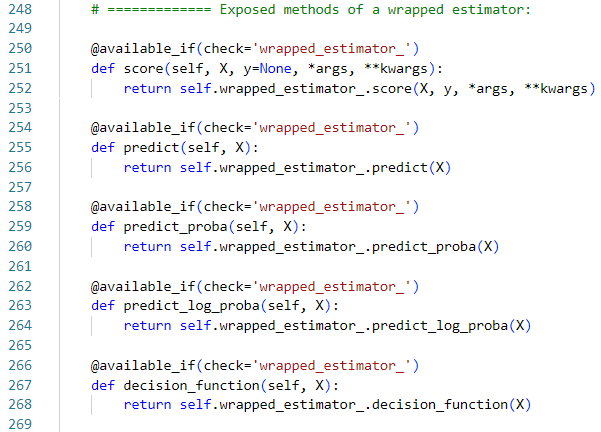
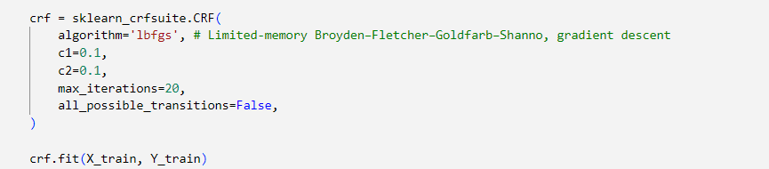
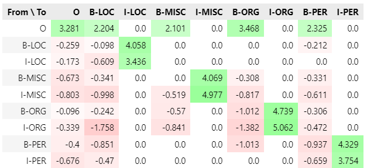
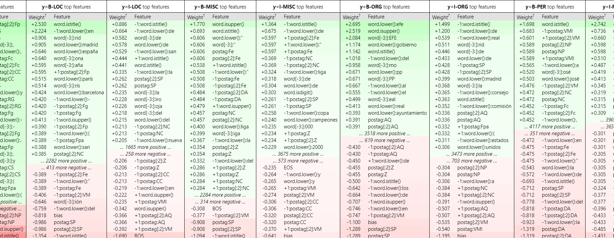
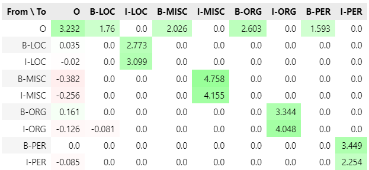
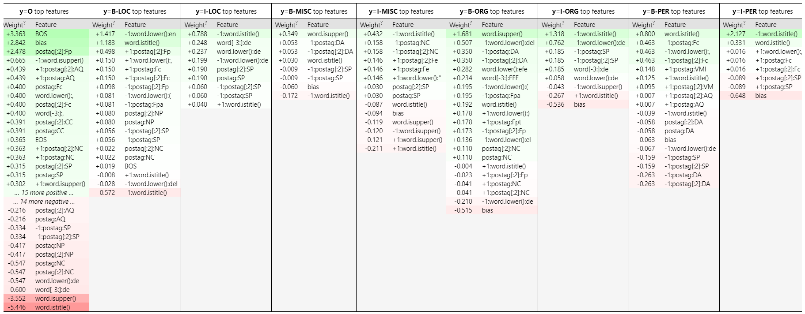
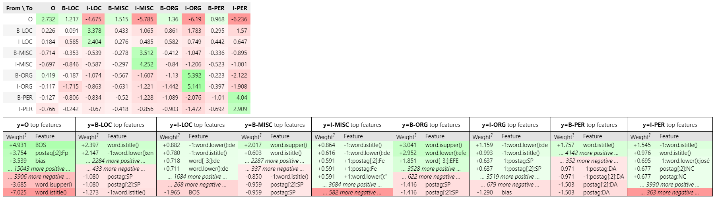

# **Mini-Project: Named Entity Recognition**
 Đây là một Mini-Project về chủ đề Nhận dạng thực thể (Named Entity Recognition) sử dụng Sklearn-crfsuite. Bằng việc huấn luyện mô hình CRF ở mức cơ bản cho việc nhận dạng trên bộ dữ liệu CoNLL2002. Từ đó thu nhận, quan sát, tinh chỉnh và đánh giá kết quả của mô hình.
## 1. Một số vấn đề có thể xảy ra khi import eli5.
- Một vấn đề ta có thể gặp phải khi sử dụng thư viện eli5 là dù đã pip install eli5 nhưng khi import eli5 thì báo lỗi. Có thể báo lỗi như: <importError: cannot import name 'if_delegate_has_method' from 'sklearn.utils.metaestimators'>.
- **Nguyên nhân:** theo như tìm hiểu có thể do sự thay đổi của sklearn trong các version mới sẽ không hỗ trợ phù hợp cho các phương thức đó nữa.
- **Cách sửa lỗi:**
    - Mở File Explorer và truy cập đường dẫn:  
    C:\Users\NameUser\AppData\Local\Programs\Python\Python312\Lib\site-packages\eli5\sklearn
    - Mở file permutation_importance.py.
    - Thay thế 'if_delegate_has_method' thành 'available_if' ở dòng from đầu. 
    
    - Kéo xuống dưới (tầm dòng 248), thay thế 'if_delegate_has_method' thành 'available_if' và thay 'delegate' thành 'check'. 
    

## 2. Mô hình CRFs (Conditional Random Field).
### 2.1. Tham số huấn luyện mô hình.

- " algorithm = 'lbfgs' ": (Limited-memory Broyden–Fletcher–Goldfarb–Shanno): một phương pháp tối ưu hóa dựa trên Gradient Descent.
- " c1=0.1 ": Hệ số điều chỉnh L1, giúp giảm thiểu số lượng đặc trưng không quan trọng bằng cách đẩy một số trọng số về số 0.
- " c2=0.1 ": Hệ số điều chỉnh L2, giúp điều chỉnh các trọng số lớn, đảm bảo rằng mô hình không quá phức tạp.
- " all_possible_transitions=False ": Quyết định xem mô hình có nên xem xét tất cả các chuyển tiếp giữa các trạng thái hay không, kể cả những chuyển tiếp không có trong dữ liệu huấn luyện.  
### **(?) Điều gì sẽ xảy ra nếu ta tăng hoặc giảm c1 (L1 Regularization)?**
- **TH1: Tăng c1.** Regularization L1 sẽ mạnh hơn, khiến nhiều trọng số của các đặc trưng nhỏ hoặc không quan trọng bị đẩy về 0. 
\* ___Kết quả:___
    - Mô hình sẽ trở nên đơn giản hơn, với ít đặc trưng quan trọng hơn được sử dụng.  
    - Giảm nguy cơ overfitting, giúp mô hình tổng quát hóa tốt hơn trên dữ liệu mới.  
    - Có thể làm giảm độ chính xác của mô hình trên tập huấn luyện, vì mô hình ít linh hoạt hơn.  
- **TH2: Giảm c1.** Regularization L1 sẽ yếu đi, cho phép nhiều đặc trưng hơn được giữ lại, kể cả những đặc trưng có trọng số nhỏ.  
\* ___Kết quả:___
    - Mô hình sẽ trở nên phức tạp hơn, sử dụng nhiều đặc trưng hơn. 
    - Tăng nguy cơ overfitting, đặc biệt là nếu dữ liệu huấn luyện có nhiễu hoặc quá nhiều đặc trưng không quan trọng. 
    - Mô hình có thể đạt độ chính xác cao hơn trên tập huấn luyện, nhưng có thể kém hiệu quả trên dữ liệu mới.
## 3. Ý nghĩa kết quả mô hình.

- Các đặc trưng chuyển tiếp có ý nghĩa: ít nhất mô hình đã học rằng I-ENTITY phải theo sau B-ENTITY. Nó cũng học được rằng một số chuyển tiếp khó xảy ra.   
Ví dụ: ngay sau tên tổ chức thường không phải là một vị trí (I-ORG -> B-LOC có trọng số âm lớn) hay B-LOC (Begin Location) có khả năng cao sau nó sẽ là I-LOC (Inside Location).

- Các đặc trưng không sử dụng từ điển địa lý, vì vậy mô hình phải nhớ một số tên địa lý từ dữ liệu huấn luyện.   
Ví dụ: España là một địa điểm.

- Ứng với từng nhãn y ta có danh sách các feature và weight tương ứng.  
Ví dụ: với cột có nhãn y = B-LOC, chúng biểu thị rằng với từ vựng nào có nhãn B-LOC thì có khả năng là tiêu đề (word.istitle()) với trọng số cao (khả năng mô hình chọn nhãn hoặc chuyển tiếp liên quan đến feature này)

Nếu chúng ta regularize CRF hơn, chúng ta có thể kỳ vọng rằng các đặc trưng duy nhất mang tính tổng quát sẽ vẫn còn, và thẻ ghi nhớ sẽ mất đi. Với hệ số chính quy L1 (tham số c1) của hầu hết các đặc trưng sẽ được chuyển về không.
### 3.1. Điều chỉnh c1.

Như chúng ta có thể thấy, các thẻ được ghi nhớ hầu hết đã biến mất và mô hình hiện dựa vào khuôn dạng từ (word shapes) và nhãn từ loại (POS tags). Chỉ còn lại một số đặc trưng khác không. Trong ví dụ này, sự thay đổi có thể khiến chất lượng kém hơn, nhưng đó là một vấn đề riêng.

### 3.2 Điều chỉnh all_possible_transitions.

Hãy tập trung vào trọng số chuyển tiếp. Chúng ta có thể cho rằng các chuyển tiếp O -> I-ENTIRY có trọng số âm lớn vì chúng là không thể. Nhưng những chuyển tiếp này có trọng số bằng không, không có trọng số âm, cả trong mô hình được chính quy hóa nhiều và trong mô hình ban đầu. Lý do chúng bằng 0 là crfsuite đã không nhìn thấy những chuyển đổi này trong dữ liệu huấn luyện và để tiết kiệm thời gian tính toán nên đã cho rằng không cần phải học trọng số đối với chúng. Đây là mặc định, nhưng có thể tắt nó bằng cách sử dụng sklearn_crfsuite.CRF tùy chọn all_possible_transitions với giá trị True.